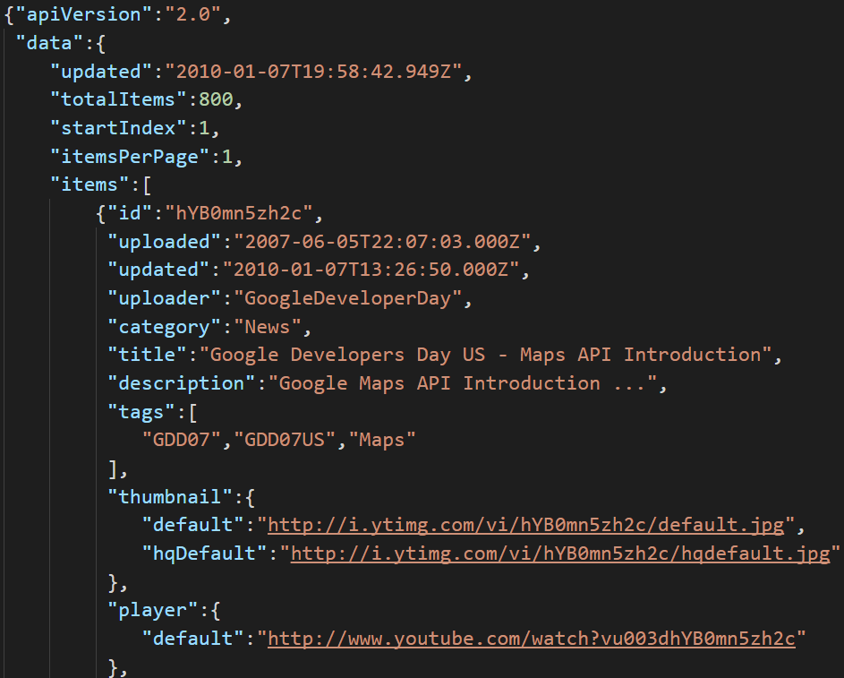
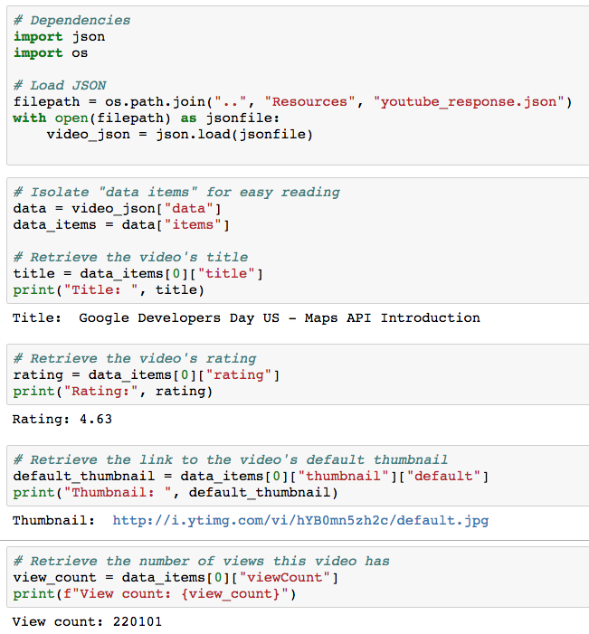
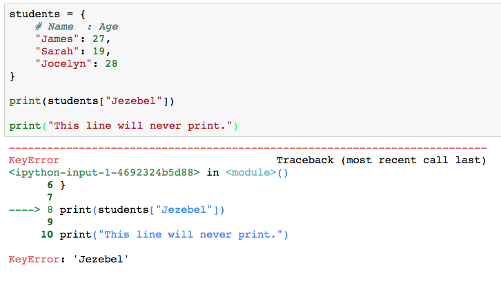
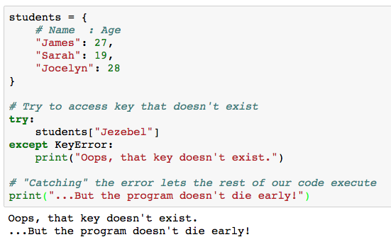
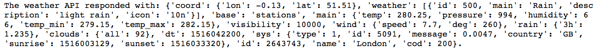
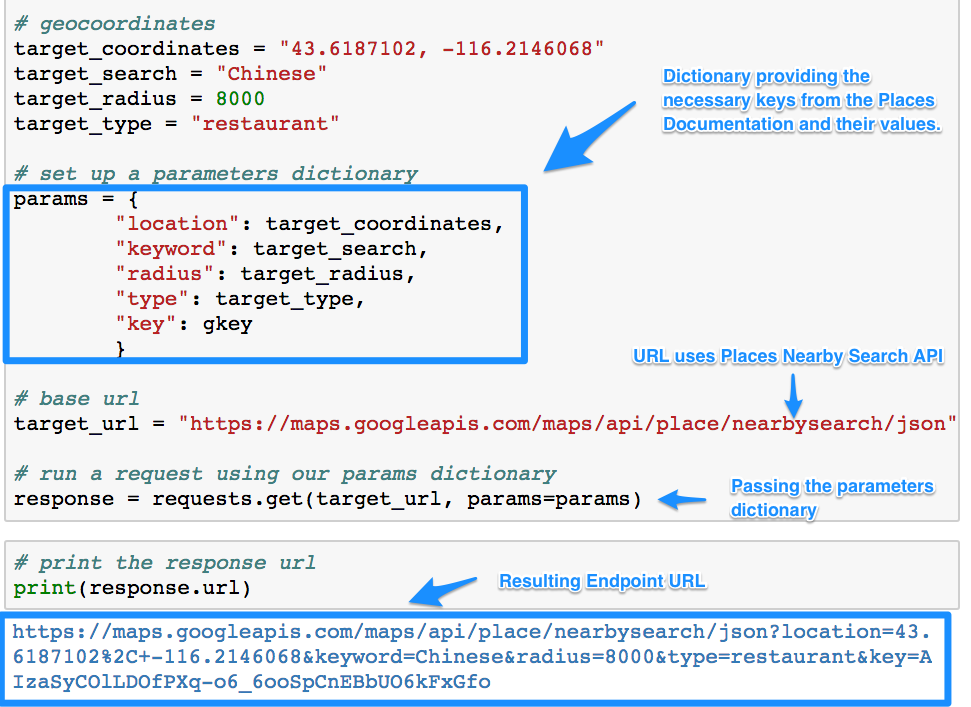

# Module 6: Live Lesson Plan (Day 2)

## Overview

Today's live lesson will review requesting data from APIs; specifically how to form API request URLs, how to traverse JSON data, how to create DataFrames from API data, handling errors, and visualizing data from APIs. This lesson builds on the weekly materials covered in "Module 6: WeatherPy" to cement and extend the topics covered in new contexts.

## Learning Objectives

At the end of the live session, learners will be able to:

* Create well-formed API requests, including parameters and API keys
* Call data from multiple API sources
* Parse JSON responses from APIs
* Save API data to Pandas DataFrames
* Handle errors with Try...Except
* Analyze data retrieved from APIs
* Visualize data retrieved from APIs

## Instructor Prep

<details>
  <summary><strong>Career Services</strong></summary>

  Just a reminder that each week students receive a Career Connection in their course of work that ties to what academic content is being consumed. This Career Connection relates this week's material to a professional setting, encourages students to complete certain Career Services tasks, and provides technical interviewing questions, where applicable, that the student can work through.

  Encourage students to work through this material and if you'd like more information on Career Services, please check out the Career Services [resource page](http://bit.ly/DataVizCS) for Data Analytics and Visualization.

</details>

- - -

# Class Activities

## 1. Warm Up & Temperature Check

| Activity Time: 0:10 | Elapsed Time: 0:10 |
|---------------------|--------------------|

<details>
  <summary><strong> 🎉 Everyone Do: Interview Question Warm-Up (5 mins before class, first 5 mins of class)</strong></summary>

Open the [slideshow](https://docs.google.com/presentation/d/1UdbkAfTElkkq4KatarHBQvAKqhKjV-LKaqXL7uG_Xyg/edit?usp=sharing) for today's class and begin the weekly presentation with the first slide.The first slide displays an interview question that a student may encounter based on the content of this week's content.

**This week's question:** Compare pulling data from an API to downloading a dataset. In what ways are APIs superior? In what ways are APIs inferior?

Allow the question to be on the screen 5 mins prior to the start of class as students join the live session. Allow the class 1 minute at the start of class to review, then you will ask for a student to volunteer their answer to the question. Next, offer the answer or a few approaches you would take for answering the question.

**Possible answers to this week's question:**

* APIs are better for real-time information

* Datasets are better for historical information

* API data is fresh, datasets can "go stale"

* Datasets can be larger than we want to work with and unwieldy

* APIs can give us only the subset of the data we want

* APIs can be rate-limited

* APIs make sharing data easy

</details>

<details>
  <summary><strong> 📣 Instructor Do: Temperature Check (5 mins)</strong></summary>

Using the [Zoom Polling](https://support.zoom.us/hc/en-us/articles/213756303-Polling-for-Meetings) feature or a [Poll Everywhere](http://www.polleverywhere.com), launch a poll of the class to identify areas that they would like to review from the week's asynchronous content.

**Poll Text:**

*Select all of the topics that you feel prepared to apply outside of the class from this week's lesson:*

* *Building API requests (Base URLs, URL parameters, API keys, etc.)*
* *Iterative API calls*
* *Parsing JSON*
* *Error Handling/Try…Except*
* *Using OpenWeatherMap*
* *Using the Google Maps Platform*
* *Linear regressions*

Based on the results of the poll, advance to the correct slide for a review of the topics with the lowest scores. Choose 2 topics at minimum to review, or more as time permits to review.

</details>

## 2. Adaptive Learning Blocks

| Activity Time:  1:10 |  Elapsed Time: 1:20  |
|----------------------|----------------------|

>***Choose:***
>
>* One 40-min block<br>
>* *and* One 30-min block
>
>***then proceed to 3. Banking Deserts Heatmap***

### Building API Requests (40 mins)

<details>
  <summary><strong> 👥 Partners Do: Number Facts (0:20)</strong></summary>

* Students will now join forces in creating an interactive application that uses the "numbers" API. The application will take in a number and then return a random fact about that number.

* Run [A1-Par_NumberFacts/number_facts.py](Activities/A1-Par_NumberFacts/Solved/number_facts.py), showing students what they will be attempting to create.

* **File:**

  * [A1-Par_NumberFacts/Par_NumberFacts.ipynb](Activities/A1-Par_NumberFacts/Unsolved/Par_NumberFacts.ipynb)

* **Instructions:** [A1-Par_NumberFacts/README.md](Activities/A1-Par_NumberFacts/README.md)

  * Using the [Numbers API](http://numbersapi.com), create an application that takes in a user's inputs and returns a number fact based upon it. Allow users the option to have a random number chosen for them.

* **Hints:**

  * The URL to make your request to must have `?json` at its end so that the data format returned is JSON. The default response for this API is pure text.

  * Make sure to read through the documentation when creating your application. Some types require more or less data than others.

</details>

<details>
  <summary><strong> 🎉 Everyone Do: Number Facts Review (0:05)</strong></summary>

* Open up [A1-Par_NumberFacts/Par_NumberFacts.ipynb](Activities/A1-Par_NumberFacts/Solved/Par_NumberFacts.ipynb) in Jupyter Notebook and run through the code with the class line-by-line, making certain to hit upon the following points.

  * The URL format for the Numbers API is `http://numbersapi.com/<Number>/<Type>?json`.

  * Since the range of random numbers will be different for years, an `if` statement should check what type of data the user would like to search for.

```python
# Dependencies
import requests
import json
import random

# Base URL for GET requests to retrieve number/date facts
url = "http://numbersapi.com/"

# Ask the user what kind of data they would like to search for
question = ("What kind of fact would you like? "
            "[Trivia, Math, or Year] ")
kind_of_search = input(question)

if(kind_of_search.lower() == "year"):
    number = input('What year would you like to search for (enter a number or "random")? ')
    if (number == 'random'):
        number = random.randint(0,2019)
else:
    number = input('What number would you like to search for (enter a number or "random")? ')
    if (number == 'random'):
        number = random.randint(0,10000)

# Make an API call to the API and get the JSON object
response = requests.get(f'{url}{number}/{kind_of_search.lower()}?json').json()

# Print the fact stored within the response
print(response["text"])
```

</details>

<details>
  <summary><strong> ✏️ Students Do: Requesting SpaceX (0:10)</strong></summary>

* This activity has students dig into a rather simple and well-documented API - The SpaceX API - and asks them to make a couple calls to the API using the Requests library.

* Open up [A2-Stu_SpaceX/Stu_SpaceX.ipynb](Activities/A2-Stu_SpaceX/Solved/Stu_SpaceX.ipynb) in Jupyter Notebook or show the students the following image to give them an idea of how the output should look.

  

* **File:** [A2-Stu_SpaceX/Stu_SpaceX.ipynb](Activities/A2-Stu_SpaceX/Unsolved/Stu_SpaceX.ipynb)

* **Instructions:** [Activities/A2-Stu_SpaceX/README.md](Activities/A2-Stu_SpaceX/README.md)

  * Take a few minutes to explore the SpaceX API: <https://github.com/r-spacex/SpaceX-API/wiki>

  * Once you understand the structure of the API and its endpoint, choose one of the endpoints and do the following:

  * Retrieve and print the JSON for _all_ of the records from your chosen endpoint.

  * Retrieve and print the JSON for a _specific_ record from your chosen endpoint.

</details>

<details>
  <summary><strong> ⭐ Review: Requesting SpaceX (0:05)</strong></summary>

* Open up [A2-Stu_SpaceX/Stu_SpaceX.ipynb](Activities/A2-Stu_SpaceX/Solved/Stu_SpaceX.ipynb) in Jupyter Notebook and run through the code with the class line-by-line, making certain to hit upon the following points.

  * While it is not required to "pretty print" the JSON response, it does make it a lot easier to understand. This means using `json.dumps()` and passing the formatting parameters desired.

    

  * To modify an API call to search for a single ID, use concatenation or string substitution to build the correct URL.  Here,   it is done in the `requests.get()` method.

    

</details>

<sub>[Having issues with this section? Report a bug!](https://bit.ly/2Wgppdi)</sub>

### Iterative API Calls (30 mins)

<details>
  <summary><strong> 📣 Instructor Do: NYT API (0:07)</strong></summary>

* Explain that the next activity will be an exercise in exploring yet another, fully-featured, "real-world" API; the New York Times article API.

* This API, unlike those which students have used up until this point in time, requires its user to register for an API key.

  * Walk through the process of acquiring an API key with the class.

  * First create an account with NYT by filling out this [form](https://developer.nytimes.com/accounts/create).

  

  * Navigate to the index of the email used to sign-up and activate the account.

  * **Note:** Make sure to have students check their spam folder for the email from New York Times article API.

  * Navigate back the [sign in page](https://developer.nytimes.com/accounts/login) and login with the newly created account.

* Once students have successfully made a NYT account and logged in, it's time to create an app and obtain an API KEY.

  * From the drop down on the top right next to their email, click on apps.

  

  * Click on **+NEW APP**.

  * This will bring you to app creation page. Give the app any name.

  

  * Scroll down to the **Article Search API** and select it.

  

  * Scroll back up to the top and click **CREATE**.

* After the app is created, you will be re-directed to the app page, which contains the API key. Explain to students that they will use this key to interact with the NYT API.

  

* Slack out the [documentation](https://developer.nytimes.com/docs/archive-product/1/overview) for the NYT API and give a brief overview of some of its features.

    

  * Try not to delve too deeply into the documentation, however, as part of the next activity should have students reading through it in order to uncover the query strings they need to create.

* Open the [A3-Ins_NYTAPI/Ins_NYT_API.ipynb](Activities/A3-Ins_NYTAPI/Solved/Ins_NYT_API.ipynb) demo within an IDE and then run the application while explaining each part of the code.

  * Highlight the use of the `config.py` file to store the `api_key`, and discuss that it is good practice to not upload API keys to GitHub.  While this API key is free, some services charge past a certain usage point.  Therefore, students should protect them from public view.  Discuss with students that they should add `config.py` to their `.gitignore` file or create environment variables for all homework and projects they will be saving to a repo.

  

</details>

<details>
  <summary><strong> ✏️ Students Do: Retrieving Articles (0:18)</strong></summary>

* Students will now create an application that grabs articles from the NYT API, stores them within a list, and prints snippets of the articles to the screen.

* Open up [A4-Stu_RetrieveArticles/Stu_Retrieve_Articles.ipynb](Activities/A4-Stu_RetrieveArticles/Solved/Stu_Retrieve_Articles.ipynb) within the console and run the application, showing students what they will be attempting to create.

  

* **File:**

  * [A4-Stu_RetrieveArticles/Stu_Retrieve_Articles.ipynb](Activities/A4-Stu_RetrieveArticles/Unsolved/Stu_Retrieve_Articles.ipynb)

* **Instructions:** [A4-Stu_RetrieveArticles/README.md](Activities/A4-Stu_RetrieveArticles/README.md)

  * Save the NYT API endpoint to a variable. Make sure you include the right query parameter to retrieve JSON data!

  * Register for and save your API Key to a variable.

  * Decide on a search term, and save it to a variable.

  * Limit your search to articles published within a range of dates—for example, only articles published in 2014. _Hint_: Read the documentation on `end_date`.

  * Build your query URL, and save it to a variable.

  * Retrieve your list of articles with a GET request.

  * Take a look at the documentation. How do you get ahold of the articles in the response?

  * Store each article in the response inside of a list.

  * Print a `snippet` from each article and separate using dashes (`-`).

  * As a bonus, try to figure out how we could get 30 results. _Hint_: Look up the `page` query parameter. If you get a message saying you've exceeded your rate limit, don't fret—you've solved the problem.

</details>

<details>
  <summary><strong> ⭐ Review: Retrieving Articles (0:05)</strong></summary>

* Open up [A4-Stu_RetrieveArticles/Stu_Retrieve_Articles.ipynb](Activities/A4-Stu_RetrieveArticles/Solved/Stu_Retrieve_Articles.ipynb) in Jupyter Notebook and run through the code with the class line-by-line, making certain to hit upon the following points.

  * Ask different students to explain their solutions for each bullet point of the Instructions.

  * Focus on explaining the various query parameters used to build the query URL. These include:

  * `api-key`, the parameter that allows the code to query the server

  * `q`, for the keyword to **q**uery on

  * `begin_date` and `end_date`, both with format YYYYMMDD

* Point out that the remainder of the activity is similar to activities students completed before — the major difference is that they had to dig through documentation to find the right keys to use for this one.

  ```python
  # Dependencies
  import requests
  import time
  from config import api_key

  url = "https://api.nytimes.com/svc/search/v2/articlesearch.json?"

  # Store a search term
  query = "obama"

  # Search for articles published between a begin and end date
  begin_date = "20160101"
  end_date = "20160130"

  query_url = f"{url}api-key={api_key}&q={query}&begin_date={begin_date}&end_date={end_date}"

  # Retrieve articles
  articles = requests.get(query_url).json()
  articles_list = articles["response"]["docs"]

  # Print out retrieved articles
  for article in article_list:
    	print(f'A snippet from the article: {article["snippet"]}')
    	print('---------------------------')
  ```

* Briefly explain the solution to the bonus.

  * Explain that each API call retrieves 10 articles by default. Each group of articles is called a _page_.

  * If we want more articles, we need to tell the API to respond with _different pages_.

  * To do this, we simply append a `page` parameter, which is equal to the number of the page we want to retrieve.

  * Point out that sending requests like this often exceeds the rate limit for free-tier users.

  * Explain that a **rate limit** is a way for an API to throttle the number of requests a given application can make, in order to prevent abuse or server overload.

  * **Note**: Warn students not to print the query URLs with their key included; this would jeopardize their key if pushed to a public repository.

</details>

<sub>[Having issues with this section? Report a bug!](https://bit.ly/2SNFiG1)</sub>

### Parsing JSON (40 mins)

<details>
  <summary><strong> ✏️ Students Do: JSON Traversal (0:15)</strong></summary>

* In this activity, students will be traversing a JSON file using their knowledge of Python.

* Open [B1-Stu_JSONTraversalReview/youtube_response.json](Activities/B1-Stu_JSONTraversalReview/Resources/youtube_response.json) with a text editor to show the class what JSON file they will be working with.

  

* **Files:**

  * [youtube_response.json](Activities/B1-Stu_JSONTraversalReview/Resources/youtube_response.json)

  * [Stu_JSON_Traversal.ipynb](Activities/B1-Stu_JSONTraversalReview/Unsolved/Stu_JSON_Traversal.ipynb)

* **Instructions:** [Activities/README.md](Activities/B1-Stu_JSONTraversalReview/README.md)

  * Load the provided JSON file.

  * Retrieve the video's title.

  * Retrieve the video's rating.

  * Retrieve the link to the video's thumbnail.

  * Retrieve the number of views.

* **Hints:**

  * In order to load in the data from an external JSON file, simply import the `json` library before using the `json.open(<FILE PATH>)` and `json.load(<JSON VARIABLE>)` methods.

</details>

<details>
  <summary><strong> ⭐ Review: JSON Traversal (0:05)</strong></summary>

* Open up [B1-Stu_JSONTraversalReview/Stu_JSON_Traversal.ipynb](Activities/B1-Stu_JSONTraversalReview/Solved/Stu_JSON_Traversal.ipynb) in Jupyter notebook and run through the code with the class line-by-line, making certain to hit upon the following points.

  * Emphasize that the best way to solve problems like this one is to inspect the JSON manually and pull it apart once its structure is clear.

  * Point out that this activity introduces no new techniques other than importing external JSON files. This challenge merely requires students to carefully read the JSON as they write their scripts.

    

</details>

<details>
  <summary><strong> ✏️ Students Do: TV Ratings (0:15)</strong></summary>

* The class will now take some time to create an application that reads in a list of TV shows, makes multiple requests from an API to retrieve rating information, creates a pandas dataframe, and visually displays the data.

* Before students complete [B2-Stu_TVRatings/Stu_TVRatings.ipynb](Activities/B2-Stu_TVRatings/Unsolved/Stu_TVRatings.ipynb) explain to them that they will be using the [TVmaze API Show Search Endpoint](https://www.tvmaze.com/api#show-search) to iterate through a list of TV shows.

  

* **File:**

  * [Stu_TVRatings.ipynb](Activities/B2-Stu_TVRatings/Unsolved/Stu_TVRatings.ipynb)

* **Instructions:** [B2-Stu_TVRatings/README.md](Activities/B2-Stu_TVRatings/README.md)

  * You may use the list provided in the starter file or create your own.

  * Request information from the TVmaze API Show Search endpoint (<https://www.tvmaze.com/api#show-search>) on each show and store the name and rating information into lists.

  * Put this data into a dictionary, and load that dict into a Pandas DataFrame.

  * Use matplotlib to create a bar chart comparing the ratings of each show.

</details>

<details>
  <summary><strong> ⭐ Review: TV_ratings (0:05)</strong></summary>

* Open up [06-Stu_TVRatings/Stu_TVRatings.ipynb](Activities/B2-Stu_TVRatings/Solved/Stu_TVRatings.ipynb) with Jupyter Notebook and run through the code with the class line-by-line, making certain to discuss the following points.

  * Ask students how data was isolated from each response and loaded it into a Pandas DataFrame.

  * For students who made their own list of TV shows, ask if any requests returned no results thereby causing an error.  This discussion might be a nice lead into the next activity on exception handling.

  * Review how to create a bar chart using matplotlib.

    

</details>

<sub>[Having issues with this section? Report a bug!](https://bit.ly/2YLjzC5)</sub>

### Error Handling/Try...Except (30 mins)

<details>
  <summary><strong> 📣	Instructor Do: Exception Handling	(0:10)</strong></summary>

* Point out that getting data from APIs can sometimes run into errors; the server may be down, missing values may be returned, the requests might be blocked due to rate limiting, etc.

* Ask a student to explain what would happen if an application tried to look up a key within a dictionary that doesn't exist.

  * If a simple key lookup is performed - such as `data["temp"]` - and the `"temp"` key doesn't exist, Python will throw an exception and terminate the program.

  * It does not make sense for an application to terminate itself just because a dictionary key doesn't exist. It would be much better to simply deal with the error than crash the app.

  * Dealing with these kinds of errors is called exception handling and thankfully Python has built-in tools for these kinds of situations.

* Open [B4-Ins_ExceptionHandling/Ins_Exception.ipynb](Activities/B4-Ins_ExceptionHandling/Solved/Ins_Exception.ipynb) within Jupyter Notebook so as to show the class how an exception error can be created.

  * Point out that the `students` dictionary does not have a key for `"Jezebel"`. As such, when the application tries to print `students["Jezebel"]`, Python will complain that the key doesn't exist.

  * Run the code within the terminal to demonstrate the error.

    

* Open [B4-Ins_ExceptionHandling/Ins_ExceptionHandling.ipynb](Activities/B4-Ins_ExceptionHandling/Solved/Ins_ExceptionHandling.ipynb) within Jupyter Notebook so as to show the class how to handle exception errors.

  * Before discussing the code in detail, simply point out the `try`/`except` keywords to the class. Briefly explain that these keywords let the application recover from errors like the one that killed the program before.

  * Run the file to demonstrate that the final print statement executes, even though the `students["Jezebel"]` line throws an exception.

    

  * Explain that `try` and `except` statements are like `for` and `if` statements insomuch as they create new indented blocks.

  * Python will try to run any code in the `try` block as normal but if that code throws exceptions, Python will then run the code inside of the `except` block before continuing to run the code that follows.

    

* Take a moment to emphasize how powerful this is. `try`/`except` allows programmers to anticipate and recover from arbitrary errors whilst preventing programs from crashing due to simple problems that can be anticipated and deal with.

* Point out that the type of exception to check for can be specified within the `except` block. This is completely optional, however, but is generally best practice to specify the precise errors to handle.

  * Catching specific exceptions allows programmers to handle specific errors in very precise ways.

  * In cases where the programmer wants to handle a particular error in a particular fashion, specifying the exception type is best practice.

  * In cases where the programmer wants to intercept any error — like for logging purposes — it is fine to catch a general exception.

* Students will know what exceptions to handle because the name of the exception that killed the program will be printed to the command line.

</details>

<details>
  <summary><strong> ✏️ Students Do: Making Exceptions (0:10)</strong></summary>

* Students will now take some time to create an application that intentionally contains a bunch of errors and, through the use of `try` and `except`, make it so the entire application runs without terminating.

* Explain that students will need to get the final line of the script to print without changing the problem code in the file.

  

* **File:**

  * [B5-Stu_MakingExceptions/Stu_MakingExceptions.ipynb](Activities/B5-Stu_MakingExceptions/Unsolved/Stu_MakingExceptions.ipynb)

* **Instructions:** [B5-Stu_MakingExceptions/README.md](Activities/B5-Stu_MakingExceptions/README.md)

  * Without removing any of the lines from the starter code provided, create `try` and `except` blocks that will allow the application to run without terminating.

</details>

<details>
  <summary><strong> ⭐ Review: Making Exceptions (0:10)</strong></summary>

* Open up [B5-Stu_MakingExceptions/Stu_MakingExceptions.ipynb](Activities/B5-Stu_MakingExceptions/Solved/Stu_MakingExceptions.ipynb) within Jupyter Notebook and run through the code with the class line-by-line, making certain to discuss the following points.

  * If there is enough time, open the starter file, run it, and wrap each "problem line" within the appropriate `try`/`except` block live to demonstrate the workflow for identifying which exceptions to use in the `except` clause.

  * Replace the `print` calls in each `except` block to `pass` statements. Run the script and demonstrate that the `try`/`except` blocks still work as before — albeit with no friendly console output.

  * This allows programmers to ignore certain errors if they simply don't care that they occurred.

  * Explain that it is good practice to wrap dictionary accesses to responses from API calls in `try`/`except` blocks, just in case not all responses have the desired key.

    

</details>

<sub>[Having issues with this section? Report a bug!](https://bit.ly/2xPg2b2)</sub>

### Using OpenWeatherMap (30 mins)

<details>
  <summary><strong> ✏️ Students Do: Weather in Burundi (0:15)</strong></summary>

* The class will now work with the OpenWeather API and create an application which provides the user with the current temperature in the largest city of Burundi.

* Before students complete the next activity, show them the following image or [C2-Stu_Burundi/Stu_Burundi.ipynb](Activities/C2-Stu_Burundi/Solved/Stu_Burundi.ipynb) in jupyter notebook so that students understand the expected output.

  

* **File:**

  * [Stu_Burundi.ipynb](Activities/C2-Stu_Burundi/Unsolved/Stu_Burundi.ipynb)

* **Instructions:** [C2-Stu_Burundi/README.md](Activities/C2-Stu_Burundi/README.md)

  * Save all of your "config" information within some variables. This includes your API key, the base URL, and the query terms desired.

  * Build your query URL. Check the documentation to figure out how to request temperatures in Celsius.

  * Make your request and save the API response.

  * Retrieve the current temperature in Burundi from the JSON response.

  * Print the temperature to the console.

* **Hint:**

  * You can find the [OpenWeatherMap Documentation](https://openweathermap.org/current) using the link provided.

* **Bonus:**

  * Augment your code to report the temperature in both Fahrenheit and Celsius.

</details>

<details>
  <summary><strong> ⭐ Review: Weather in Burundi (0:05)</strong></summary>

* Open up [C2-Stu_Burundi/Stu_Burundi.ipynb](Activities/C2-Stu_Burundi/Solved/Stu_Burundi.ipynb) in Jupyter Notebook and run through the code with the class line-by-line asking different students how they implemented each task in the instructions.

* Try to focus in upon the following points:

  * When building the query URL, remind students that this is the most important piece of making an API call as it determines what information will be returned by the request.

  * The `units` query parameter: Remind students that they simply need to dig through documentation to find "options" like this. Encourage them to spend a lot of time reading the documentation of an API before writing code as this will save them time.

    

  * Ask students to offer explanations of how they solved the bonus.

</details>

<details>
  <summary><strong> 📣 Instructor Do: OpenWeatherMap API (0:10)</strong></summary>

* Explain that the next API students will work with is the [OpenWeatherMap API](https://openweathermap.org/api), which provides various sorts of meteorological data for developers to use.

* Explain that, like the New York Times API, the OpenWeatherMap API requires users to [register](https://home.openweathermap.org/users/sign_up) for an API key.

  * Briefly walk students through the [sign-up](https://home.openweathermap.org/users/sign_up) steps and make sure everyone has their API key in-hand before moving on to the demonstration.

  

* Open [C3-Ins_OpenWeatherRequest/Ins_OpenWeatherRequest.ipynb](Activities/C3-Ins_OpenWeatherRequest/Solved/Ins_OpenWeatherRequest.ipynb) with jupyter notebook to show students what the application does.

  

  * Remind students that it is good practice to use `config.py` file to shield their api_keys from others' view.

  * Point out that this script repeats the same patterns as those written for APIs the class is already familiar working with.

  * Ask a student to explain what the question mark in the URL indicates before explaining how the question mark represents the beginning of the query string.

  * Ask a student to explain what they think the query URLs is requesting before discussion how the `q` parameter allows the application to search for weather by city name in English.

  * Ask a student to explain the logic of the rest of the file and then explain how the rest of the file simply sends a GET request to the query url, converts the response to JSON, and prints the result.

  

</details>

<sub>[Having issues with this section? Report a bug!](https://bit.ly/2LekJ0Y)</sub>

### Using the Google Maps Platform (40 mins)

<details>
  <summary><strong> ✏️ Students Do: Google Drills (0:20)</strong></summary>

* The class will now create some code that makes calls to both the Google Places and Google Geocoding APIs.

* Slack out the starter file for [C4-Stu_Google_Drills/Google_That.ipynb](Activities/C4-Stu_Google_Drills/Unsolved/Google_That.ipynb) and open in Jupyter Notebook in order to explain the instructions to students.

* **File:**

  * [C4-Stu_Google_Drills/Google_That.ipynb](Activities/C4-Stu_Google_Drills/Unsolved/Google_That.ipynb)

* **Instructions:** [C4-Stu_Google_Drills/README.md](Activities/C4-Stu_Google_Drills/README.md)

  * Complete each of the six drills articulated in the code provided. Feel encouraged to look back at the previous examples but know that you will have to consult the Google API documentation.

* **Hints:**

  * See the [Google Geocoding Documentation](https://developers.google.com/maps/documentation/geocoding/intro)

  * See the [Google Places Documentation](https://developers.google.com/maps/documentation/javascript/places#place_search_requests)

</details>

<details>
  <summary><strong> ⭐ Review: Google Drills (0:05)</strong></summary>

* Open up [C4-Stu_Google_Drills/Google_That.ipynb](Activities/C4-Stu_Google_Drills/Solved/Google_That.ipynb) within Jupyter Notebook and run through the code with the class line-by-line, making certain to hit upon the following points.

  * For the most part, the solution to these drills are self-explanatory. The only notable differences are that, in the last two drills, students would need to use a "Keyword Search" and a "Text Search". Both of these search types are articulated in the Google Places documentation.

  * Keyword Search

    

  * Text Search

    

</details>

<details>
  <summary><strong> 📣 Instructor Do: Google Places (0:15)</strong></summary>

* Now open up the [Google Places API](https://developers.google.com/maps/documentation/javascript/places#place_searches) and take a moment to walk students through the documentation for a bit.

  * In essence, the points to emphasize are: [Nearby Search](https://developers.google.com/places/web-service/search#PlaceSearchRequests), [Text Search](https://developers.google.com/places/web-service/search#TextSearchRequests), and [Place Search](https://developers.google.com/places/web-service/search#RadarSearchRequests).

  * When talking about Nearby Search, point out the inputs (Lat/Lng, Radius) and the various optional parameters including: keyword, minPrice, maxPrice, type, etc.

  * It may also be beneficial to point out the various [types](https://developers.google.com/places/supported_types) Google categorizes by default. Students will be using the "bank" type later in the day when they start creating visualizations for Banking Deserts.

* Once students have a decent enough understanding of the API, open up [C5-Ins_Google_Places/Google_Places.ipynb](Activities/02-Ins_Google_Places/Solved/Google_Places.ipynb) in Jupyter Notebook and explain the code.

  * For the most part, the code is similar to the earlier example. The base URL, however, has changed since the class is now using the Google Place Search API.

  * In this example, we are using a feature of the [requests library](http://docs.python-requests.org/en/master/user/quickstart/#passing-parameters-in-urls) in order to easily construct our url by passing in a dictionary of parameters.

  * During the discussion of this example, point out the various URL parameters like `keyword`, `location`, and `types`. Also point out the different JSON structure that is provided back to the user.

    

</details>

<sub>[Having issues with this section? Report a bug!](https://bit.ly/2YJz79C)</sub>

### Linear Regressions (40 mins)

<details>
  <summary><strong> 📣 Instructor Do: Fits & Regression (0:10)</strong></summary>

* Explain that an important piece of statistics is the subject of **regressions**.

* Remind students that regression analysis allows us to take a data set and "reverse engineer" an equation describing it.

  * Point out that measures like the median, variance, and IQR _describe_ data sets, but do not allow us to make _predictions_ with it.

  * Remind students that it is tools like regression that allow us to predict where data points we _did not_ measure might end up if we _had_ collected more data.

  * Remind students that it is such tools that allow us to predict house prices, stock market movements, and the weather — regression is a truly powerful tool.

* Reassure students that we will not dive into the mathematical details of regression — rather, we will focus on how to use SciPy to generate a regression line.

* Open the regression example file: [D1-Ins_Fits_and_Regression/regression.ipynb](Activities/D1-Ins_Fits_and_Regression/Solved/regression.ipynb).

  * Explain that the appropriate function for this task is [SciPy's linregress function](https://docs.scipy.org/doc/scipy/reference/generated/scipy.stats.linregress.html).

  * Point out that the first thing we do is generate fake data.

  * Here, we have done this to make the behavior of `linregress` easy to see in the plot produced later.

  * Next, we call `linregress` with `x_axis` and our fake data.

  * Point out that `linregress` returns a lot of values, most of which we throw away.

  * For our purposes, the most important are the slope and intercept values, which we use to define the regression line — the rest are discussed in the documentation linked above.

  * Finally, explain how we define the regression line.

  * Remind students that the equation for a line looks like: `line = slope * x_axis_values + y_intercept`.

  * Here, we create an array containing the points of the line by simply writing this equation directly, with the values returned by `linregress`.

    

* Briefly display the rest of the code, pointing out that it is standard Matplotlib.

* Run the code to demonstrate the results of plotting the data and over-plotting the regression line.

  

* Slack out the code for students to refer to during the next activity.

</details>

<details>
  <summary><strong> ✏️ Students Do: Fits & Regression (0:20)</strong></summary>

* **Files:**

  * [README](Activities/D2-Stu_Fits_and_Regression/README.md).

  * [crime_data.csv](Activities/D2-Stu_Fits_and_Regression/Resources/crime_data.csv)

* **Instructions:**

  * Import `stats` from the scipy module, along with `numpy` and `pandas`.

  * Use Pandas to read in the data.

  * Use `iloc` to isolate the year column.

  * Use `iloc` to isolate the total violent crime rate, murder rate, and aggravated assault rate columns.

  * Use `stats.linregress` to perform a linear regression with the year and violent crime rate columns.

  * Use `stats.linregress` to perform a linear regression with the year and murder rate columns.

  * Finally, use `stats.linregress` to perform a linear regression with the year and aggravated assault rate columns.

  * Use the information returned by `stats.linregress` to create an equation for a line describing each of the linear regressions you performed (see the hint below).

    * You should end up with three separate lines.

  * Use `subplots` to create a figure with subplots that share an x-axis.

  * Use `plot` to plot each of the lines you created against the year.

  * Display the plot.

* **Bonus**

  * Use the line you created for the total violent crime rate to determine what the violent crime rate will be in 2019.

* **Hints**

  * See the documentation for [stats.linregress](https://docs.scipy.org/doc/scipy-0.19.0/reference/generated/scipy.stats.linregress.html).

  * Recall that `stats.linregress` returns a slope, called `m`, and a y-intercept, called `b`. These let you define a line for each fit by simply writing: `fit = m * year + b`, for each linear regression you perform.

</details>

<details>
  <summary><strong> ⭐ Review: Fits & Regression (0:10)</strong></summary>

* Open the solution to the previous activity: [D2-Stu_Fits_and_Regression/crime.ipynb](Activities/D2-Stu_Fits_and_Regression/Solved/crime.ipynb).

* Explain that the first step is simply to load the data and extract the appropriate columns.

  

* Explain that the next step is to calculate the parameters of the regression line for each data set, and then calculate the line of fit.

  * Point out that, here, the solution has retained all of the return values from `linregress`.

  * Explain that this is not necessary for this assignment, but that the parameters are included simply to demonstrate what it would look like if we _did_ want to use them later.

* Point out that most of the remaining code is simple Matplotlib. Here, we have taken advantage of the class interface to produce an impressive array of subplots.

* Jump to the bottom of the file, and explain how we make predictions as to what the crime rate will be in the year 2019.

  * Remind students that the equation of a regression line is given by `line = slope * x_value + intercept`.

  * Explain that we can use this equation to predict the value of a point _not_ in our data set by replacing `x_value` with a specific number — in this case, 2019.

* Run the code to demonstrate the output.

  

* Slack out the solution for students to refer to later, and congratulate them on their hard work — today's lesson is difficult material, and producing an array of subplots with regression lines from _real_ crime data released by the FBI is an extremely impressive accomplishment!

</details>

<sub>[Having issues with this section? Report a bug!](https://bit.ly/2YMPa6I)</sub>

- - -

## 3. Banking Deserts Heatmap

| Activity Time:  0:40 |  Elapsed Time: 2:00  |
|----------------------|----------------------|

<details>
  <summary><strong> ✏️ Students Do: Banking Deserts Heatmap (0:30)</strong></summary>

* Slack out the article on [banking deserts](https://www.theatlantic.com/business/archive/2016/03/banking-desert-ny-fed/473436/) from the Atlantic. Explain to students that "banking deserts" are a socioeconomic phenomenon in which many low-income and elderly areas tend to have no or few banking services available. The end-result is that these communities are often preyed upon by high-interest "check cashing" and "fast cash now" providers.

* Explain to students that they'll be creating a data visualization to understand how prominent the "banking desert" phenomenon truly is. In order to accomplish this, they will be utilizing the US Census and their newfound skills with the Google Geocoder API and Jupyter Gmaps.

* **Files:**

* [zip_bank_data.csv](Activities/2-Stu_BankDeserts_Heatmap/Resources/zip_bank_data.csv)

* [Unsolved/Banking_Deserts_HeatMap.ipynb](Activities/2-Stu_BankDeserts_Heatmap/Unsolved/Banking_Deserts_HeatMap.ipynb)

* **Instructions**

* In this activity your broad task is to answer the question: "What is the relationship between poverty, age, and population with the number of banks in a given area?" To help accomplish this task, you've been given census data for every zip code across the country.

* Visit the documentation page for the [census-wrapper](https://github.com/datamade/census), which provides additional examples for using the Census API.

* Run `pip install census` in the terminal to install the wrapper and obtain a [Census API key](https://api.census.gov/data/key_signup.html) from the US Census Bureau. **Note:** It will take 2-3 minutes after you enter your information into the form to get a Census API key.

* Starter code for the census wrapper has already been included. In essence, the wrapper provides data from the 2013 census based on zip code, state, district, or county.

  * Each census field (e.g. Poverty Count, Unemployment Count, etc.) is denoted with a label like B201534_10E. In using the API, developers list out each of the desired fields based on their labels.

  * The results are then returned as a list of dictionaries, which can be immediately converted into a DataFrame.

* Using [zip_bank_data.csv](Activities/1-Stu_BankDeserts_Heatmap/Resources/zip_bank_data.csv) and your new knowledge of the US Census API, add a column for Unemployment Rate to the csv.

* Using `gmap` create the following three figures:

  * A map with a `heatmap_layer` of the poverty rate for each city.

  * A map with a `symbol_layer` for the number of banks located at that city.

  * A map that includes both the poverty `heatmap_layer` and the bank `symbol_layer`.

* **Hints**

* Test your code with only 5-10 cities at a time while debugging.

* For reference, use the docs for the [layers](http://jupyter-gmaps.readthedocs.io/en/latest/api.html#figures-and-layers) and as a [refresher](http://jupyter-gmaps.readthedocs.io/en/latest/tutorial.html) for setting up the maps.

* Be sure to handle zoom on the heatmap.

* At this point, you should not need to perform any new requests to Google's APIs.

* To format the info boxes on your `symbol_layer`, look to use string formatting with list comprehension.

</details>

<details>
  <summary><strong> ⭐ Review: Banking Deserts Heatmap (0:10)</strong></summary>

* Open [2-Stu_BankDeserts_Unemployment/Solved/Banking_Desert_HeatMap.ipynb](Activities/2-Stu_BankDeserts_Heatmap/Solved/Banking_Desert_HeatMap.ipynb) in jupyter notebook and go through the code. Along the way be sure to explain:

  * Find the unemployment rate by dividing the `Unemployment Count` by `Population`. Be sure to that each column is converted to an integer.

  * Create a new census dataframe  by selecting  "Zipcode", "Population", and "Unemployment Rate".

  * Combine the data by loading "zip_bank_data.csv" into a dataframe and merge on  **Zipcode** with the census dataframe that was just created.

    

  * Configure `gmaps` by adding in an API key.

  * Grab the "Lat" and "Lng" to be stored as the locations that will be used in the heatmap. "Poverty Rate" will be used as the weight on the heatmap. Both these values will need to convert into floats.

  * A `heatmap_layer` is then created, added to the figure and displayed. Be sure to pass the arguments that handle the map dissipating when zoomed.

    

  * "Bank Rate" is converted to a list in order to be passed in as `info_box_content` to the `symbol_layer`.

  * A symbol layer is created by passing in locations and "Bank Rate". The additional arguments are stylistic and can adjusted to help clear up how the map will look. The list comprehension `f"Bank amount: {bank}" for bank in bank_rate` will allow the bank data to be customized and added to the map. Finally the `symbol_layer` is added to the figure and displayed.

    

  * For the last steps, a new map is created by adding both the `heatmap_layer` and the `symbol_layer` before displaying the figure.

    

</details>

<sub>[Having issues with this section? Report a bug!](https://bit.ly/3bbbuJC)</sub>

- - -

### Supplemental Content (Optional, 15 mins)

<details>
  <summary><strong> 📣 Instructor Do: OpenWeatherMap DataFrame (0:10) </strong></summary>

* If students need more practice with putting API data into DataFrames, do this optional activity.

* Remind students that they are not limited to manipulating API responses manually as they can use Pandas to manipulate the large amounts of data returned by APIs in bulk.

* Open [B3-Ins_OpenWeatherDataFrame/Ins_OpenWeatherDataFrame.ipynb](Activities/B3-Ins_OpenWeatherDataFrame/Solved/Ins_OpenWeatherDataFrame.ipynb) within Jupyter Notebook in order to show students how Pandas can be used to organize/manipulate the data retrieved from an API.

  * Point out that the beginning of this script is no different from before where the configuration information is set and stored.

* Explain that it might be interesting to look at how the temperature in a country changes based upon its latitude.

* Refer to the [OpenWeatherMap API documentation](https://openweathermap.org/current#data) or [sample response](http://samples.openweathermap.org/data/2.5/find?q=London&appid=b6907d289e10d714a6e88b30761fae22) and point out that our responses have both these pieces of data stored within them.

* Explain that a for loop is used to send a request to the Weather API for each city stored within the `cities` list, and then the desired data is appended to respective lists.

  

* Since the application has now collected data on each of the cities desired, a dictionary can be created in order to use a Pandas DataFrame to house this data.

    

* Point out that the rest is simple matplotlib. Simply call `scatter()` on the DataFrame to create a scatter plot of the temperatures versus the latitudes.

    

</details>

<details>
  <summary><strong> 📣	Instructor Do: CitiPy	(0:05)</strong></summary>

* Open [C1-Ins_CitiPy/Ins_CitiPy_Demo.ipynb](Activities/C1-Ins_CitiPy/Solved/Ins_CitiPy_Demo.ipynb) with Jupyter Notebook and run the code.

  * Point out that this code generates a list of city names for us when provided with a list of coordinates.

* Explain that CitiPy is being utilized in the for loop to add cities for every pair of coordinates in our list.

    

  * Emphasize that students will be responsible for determining precisely _how_ to do this in their homework assignment as well.

* Slack out the example file and the citipy documentation (<https://github.com/wingchen/citipy>) before dismissing class.

</details>

## 4. Office Hours Announcement

Before you dismiss your class, let them know that the first few minutes of Office Hours will include a walkthrough of the Challenge requirements, rubric, and helpful tips to ensure they know exactly what they need in order to be successful. Encourage them to stay, even if its only for a portion of the post-class Office Hours.

<details>
  <summary><strong>  📣 Instructor Do: Challenge Instruction Walk Through</strong></summary>

Open the Challenge Instructions in Canvas and go through the high-level requirements with your class. Be sure to check for understanding.

Open the Rubric in Canvas and go through the Mastery column with your class and show how it maps back to the requirements for each deliverable. Be sure to check for understanding.

Review the following tips to ensure clarity on the Challenge:

The first part of the assignment, **Deliverable 1: Retrieve Weather Data**, should not be too challenging as it will draw on their skills and knowledge of Python and parsing JSON data they learned in this module.

* First, they'll need to create a new set of 2,000 random latitudes and longitudes and get the nearest city using the `citypy` module.

* Next, using their OpenWeatherMap API key, they'll retrieve all the weather data they retrieved in the module plus the **weather description**.

* Then they'll add all the data to a DataFrame and export the DataFrame into the "Weather_Database" folder as `WeatherPy_Database.csv`.

For the second part of the assignment, **Deliverable 2: Create a Customer Travel Destinations Map**, should not be too challenging as it will draw on their use of the Google Maps and Places API they learned in this module.

We have provided a [Vacation Search starter code](../../../01-Assignments/06-WeatherPy/Resources/Vacation_Search_starter_code.ipynb) that has comments as to where the learners will need to add code to complete this part of the challenge.

* Using input statements they'll need to filter the `WeatherPy_Database.csv` on the minimum and maximum temperature preferences to identify potential travel destinations.

* Next, they'll need to use the Google Maps and Places API to find nearby hotels and add the hotels to the `hotel_df` DataFrame.

* Before they create a marker layer map they'll need to drop the rows in the DataFrame where there is no hotel name, and then export the DataFrame into the "Vacation_Search" folder as `WeatherPy_vacation.csv`.

* Finally, they'll create a marker layer map with pop-up markers. The pop-up marker should show, the hotel name, the city, the country, and the current weather description with the maximum temperature.

For the last part of the assignment, **Deliverable 3: Create a Travel Itinerary Map**, the learners will need to create a travel route itinerary using the Google "Directions API" consisting of four cities in `WeatherPy_vacation.csv` file. Then they'll to create a marker layer map with a pop-up marker for each city on the itinerary.

For this part of the challenge we have provided a [Vacation Itinerary starter code](../../../01-Assignments/06-WeatherPy/Resources/Vacation_Itinerary_starter_code.ipynb) that has comments as to where the learners will need to add code to complete this part of the challenge.

* After the learners import the `WeatherPy_vacation.csv` file as a DataFrame and create a marker layer map, they should pick four cities in the same country to create a travel route.

* To get started on creating a travel route, they'll need to create separate DataFrames for each city using the `loc` method on the DataFrame above.

* Next, they will need to retrieve the latitude-longitude pairs as tuples for each city using the Pandas `to_numpy()` function with list indexing for each DataFrame. We have provided variables to get them started and a hint that shows documentation on how to use the `to_numpy()` function.

* Next, the learners will need to use the variables we provided in the starter code for the latitude-longitude pairs to create a travel route. Using the [gmaps documentation](https://jupyter-gmaps.readthedocs.io/en/latest/tutorial.html#directions-layer) the learners will create a directions layer map using the Google "Directions API".

  * For the travel route, the starting and ending city should be the same city and the `waypoints` are the three other cities, the `travel_mode` is either, `DRIVING`, `BICYCLING`, or `WALKING`.

* Finally, they will create a marker layer map of the four cities on the travel route.

  * First, they will need to combine all four DataFrames for each city using the Pandas `concat()` function. We have provided a code snippet in the starter code and a hint that shows documentation on how to use the `concat()` function.

  * For the marker layer map, each pop-up marker should show the hotel name, the city, the country, and the current weather description with the maximum temperature.

Encourage your class to begin the Challenge as soon as possible, if they have not already begun, and to use the Learning Assistants channel and pre-scheduled Office Hours with their instructional team for help as they progress through their work. If they feel like they need context to understand documentation or instructions throughout the week, this is where they can get it.

Open the floor to discussion and ensure to answer any questions they may have about the Challenge requirements before moving onto other areas of interest.

</details>
